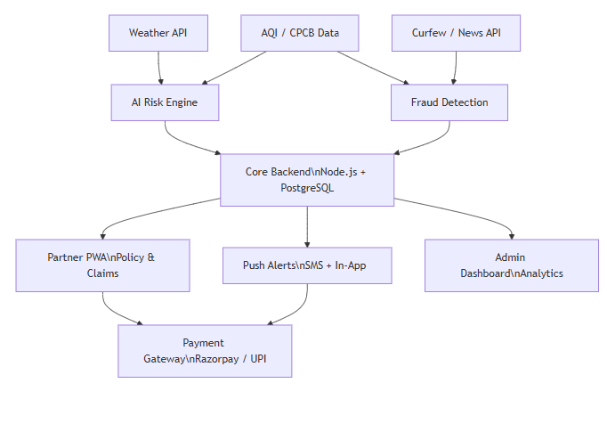

# 🛡️ ShieldGig — AI-Powered Parametric Income Insurance for Q-Commerce Delivery Partners

> **Guidewire DEVTrails 2026 | University Hackathon**
> Protecting the last-mile warriors of India's instant delivery economy.

---

## System Architecture



---

## 📌 Table of Contents

1. [Problem Understanding & Persona](#1-problem-understanding--persona)
2. [Real-Life Scenario](#2-real-life-scenario)
3. [Application Workflow](#3-application-workflow)
4. [Weekly Premium Model](#4-weekly-premium-model)
5. [Parametric Triggers](#5-parametric-triggers)
6. [AI/ML Integration Plan](#6-aiml-integration-plan)
7. [Platform Choice & Justification](#7-platform-choice--justification)
8. [Tech Stack](#8-tech-stack)
9. [Development Plan](#9-development-plan)
10. [Innovation Highlights](#10-innovation-highlights)

---

## 1. Problem Understanding & Persona

### 👤 Who is Our User?

**Persona: Zepto / Blinkit Q-Commerce Delivery Partner**

- **Name:** Ravi Kumar (representative persona)
- **Age:** 24
- **City:** Chennai, Tamil Nadu
- **Earnings:** ₹600–₹900/day (₹4,200–₹6,300/week) based on order volume
- **Working Hours:** 9 AM – 10 PM, 7 days/week
- **Delivery Model:** Hyper-local, 10-minute delivery windows
- **Device:** Android smartphone (primary interface)

### ❗ Problems They Face

Q-Commerce delivery partners face **unique, heightened vulnerabilities** compared to food delivery:

| Disruption | Impact on Ravi |
|---|---|
| Heavy rain / flooding | Cannot ride safely; zero deliveries for 4–8 hours |
| Extreme heat (>42°C) | Health risk; reduced working hours by law/choice |
| Severe AQI (>300) | Outdoor work becomes dangerous; delivery halts |
| City curfew / bandh | Complete zone lockdown; zero income for the day |
| Hyperlocal zone closure | Dark store inaccessible; cannot pick up orders |

**Key insight:** Q-Commerce workers operate in **10-minute delivery windows** — even a 2-hour disruption during peak hours (6–9 PM) can wipe out 30–40% of their daily income. Unlike food delivery, Q-Commerce has no "slow period" buffer — every hour counts.

> ⚠️ **Coverage Scope:** This platform insures **LOSS OF INCOME ONLY**. It does NOT cover health, vehicle repair, accidents, or any physical damage.

---

## 2. Real-Life Scenario

**Date:** August 15, 2025 — Independence Day, Chennai

- **7:00 AM:** IMD issues Red Alert for heavy rain (>115mm expected)
- **ShieldGig detects** the alert via Weather API for Ravi's registered zones (Velachery, Adyar)
- **9:00 AM:** Rainfall crosses 40mm/hr threshold. Parametric trigger activates.
- **9:01 AM:** ShieldGig automatically logs a claim on Ravi's behalf — **zero action required from Ravi**
- **9:05 AM:** Fraud detection engine validates: GPS confirms Ravi is stationary in delivery zone, weather data cross-verified from 2 sources, no duplicate claim
- **9:07 AM:** ₹280 income protection payout credited to Ravi's UPI — covering ~4 lost delivery hours
- **Ravi never filed anything.** He just received a notification: *"Heavy rain detected in your zone. ₹280 income protection credited. Stay safe 🌧️"*

---

## 3. Application Workflow

```
┌─────────────────────────────────────────────────────────┐
│                    SHIELDGIG WORKFLOW                     │
└─────────────────────────────────────────────────────────┘

STEP 1: ONBOARDING (One-time, ~3 minutes)
  ├── Partner logs in via phone number (OTP)
  ├── Links delivery platform ID (Zepto/Blinkit partner ID)
  ├── Selects primary delivery zones (up to 3 pin codes)
  ├── AI Risk Engine profiles the worker:
  │     ├── Zone flood/heat/AQI historical risk score
  │     ├── Seasonal disruption frequency
  │     └── Generates personalised Weekly Premium quote
  └── Partner reviews and activates weekly plan

STEP 2: ACTIVE COVERAGE (Ongoing, automated)
  ├── System monitors weather, AQI, and social disruption data
  ├── Checks every 15 minutes for trigger conditions
  ├── Partner continues working normally
  └── Zero manual interaction required

STEP 3: DISRUPTION DETECTED
  ├── Trigger condition met (e.g., rain > 40mm/hr)
  ├── System cross-validates: 2+ data sources + GPS check
  ├── Fraud detection runs (<5 seconds):
  │     ├── Is partner GPS in declared zone? ✓
  │     ├── Is disruption real? (cross-source validation) ✓
  │     └── Has partner already claimed this event? ✓
  └── Claim auto-approved or flagged for review

STEP 4: PAYOUT PROCESSING
  ├── Payout amount calculated based on:
  │     ├── Hours disrupted (capped at 8 hrs/day)
  │     ├── Partner's historical average hourly earnings
  │     └── Disruption severity multiplier
  └── Instant credit to UPI/bank (mock in Phase 1–2)

STEP 5: NOTIFICATION & DASHBOARD
  ├── Partner receives push notification + SMS
  ├── Dashboard updates: claims history, weekly coverage, earnings protected
  └── Admin dashboard: loss ratios, zone risk heatmaps, fraud flags
```

---

## 4. Weekly Premium Model

### 💰 Pricing Philosophy

Premiums are **weekly, dynamic, and hyper-local** — not flat rates. A partner in a flood-prone area pays more; a partner in a low-risk zone pays less.

### Base Premium Tiers

| Coverage Tier | Weekly Premium | Max Weekly Payout | Best For |
|---|---|---|---|
| **Basic** | ₹39/week | ₹500 | Low-risk zones |
| **Standard** | ₹69/week | ₹1,000 | Moderate-risk zones |
| **Premium** | ₹99/week | ₹1,800 | High-risk / monsoon zones |

### 📊 Dynamic Pricing Factors (AI-Calculated)

```
Weekly Premium = Base Rate
              × Zone Risk Multiplier (0.8x – 1.4x)
              × Seasonal Adjustment (0.9x – 1.3x)
              × Disruption Forecast Score (0.95x – 1.2x)
```

**Zone Risk Multiplier** is computed from:
- Historical flood/waterlogging incidents in the pin code
- Average AQI levels (last 12 months)
- Strike/curfew frequency in the area

**Example Calculation:**
- Ravi operates in Velachery (Chennai) — moderate flood risk
- Base rate: ₹69 (Standard tier)
- Zone Risk: 1.2x (Velachery has known waterlogging history)
- August seasonal adjustment: 1.15x (monsoon season)
- **Ravi's actual weekly premium: ₹69 × 1.2 × 1.15 ≈ ₹95/week**

### Payout Calculation

```
Payout = (Avg Hourly Earnings) × (Hours Disrupted) × (Severity Factor)

Where:
  Avg Hourly Earnings = Partner's weekly income ÷ active hours logged
  Hours Disrupted     = Disruption duration (capped at 8 hrs/day)
  Severity Factor     = 0.7 (minor) | 1.0 (moderate) | 1.2 (severe)
```

---

## 5. Parametric Triggers

> All triggers are **automatic** — no manual claim filing ever required.

| Trigger | Condition | Data Source | Payout Severity |
|---|---|---|---|
| **Heavy Rain** | Rainfall ≥ 40mm/hr for 30+ min | OpenWeatherMap API | Moderate–Severe |
| **Extreme Heat** | Temperature ≥ 42°C for 2+ hours | OpenWeatherMap API | Minor–Moderate |
| **Severe Air Pollution** | AQI ≥ 300 (Hazardous) for 1+ hour | CPCB API / AQI mock | Moderate |
| **Flash Flood Warning** | IMD Red Alert issued for partner's zone | IMD RSS feed / mock | Severe |
| **Curfew / Bandh** | Government-declared shutdown in zone | News API / manual flag | Severe |
| **Dark Store Closure** | Partner's assigned Zepto/Blinkit hub closed unexpectedly | Platform webhook / mock | Moderate |

### Trigger Validation Logic (Fraud Prevention Layer)

Before any trigger fires a payout:
1. **Dual-source validation** — event must be confirmed by 2 independent data sources
2. **GPS cross-check** — partner's last known location must be in declared active zone
3. **Activity check** — partner must have been online/active on platform before disruption
4. **Duplicate guard** — system rejects multiple claims for the same event window

---

## 6. AI/ML Integration Plan

### 6.1 Dynamic Premium Calculation (Risk Scoring Model)

- **Model Type:** Gradient Boosted Trees (XGBoost / LightGBM)
- **Input Features:**
  - Zone pin code risk history (flood, heat, AQI events)
  - Month / season
  - Partner's active delivery zones
  - Disruption frequency in last 30 days
- **Output:** Risk score (0–100) → maps to pricing multiplier
- **Training Data:** Historical IMD weather data, CPCB AQI records, synthetic disruption datasets

### 6.2 Fraud Detection (Anomaly Detection)

- **Model Type:** Isolation Forest + Rule-based validation
- **What it detects:**
  - GPS spoofing (partner claims to be in active zone but movement patterns inconsistent)
  - Fake disruption claims (weather data doesn't match claimed event)
  - Duplicate claim submission (same event, multiple accounts)
  - Velocity fraud (abnormally high claim frequency)
- **Implementation:** Real-time inference (<500ms) at claim trigger time

### 6.3 Predictive Risk Forecasting (Phase 3)

- **Model Type:** LSTM time-series model
- **Purpose:** Predict next-week disruption probability per zone
- **Used for:** Proactively alerting partners, adjusting next week's premium

### 6.4 Income Baseline Estimation

- **Method:** Moving average of partner's delivery earnings (via platform API mock)
- **Used for:** Accurate payout calculation based on real income, not flat rates

---

## 7. Platform Choice & Justification

**Platform: Progressive Web App (PWA) — Web-first, mobile-optimised**

| Factor | Reasoning |
|---|---|
| **Accessibility** | Q-Commerce partners use mid-range Android phones; PWA works without app store install |
| **Low friction** | Partners can onboard via WhatsApp link — no download required |
| **Push notifications** | PWA supports push notifications for instant payout alerts |
| **Admin dashboard** | Web platform allows insurer/admin analytics dashboard on desktop |
| **Phase 1 scope** | Faster to prototype and demo as a web application |

**Future Phases:** Native Android app (React Native) for deeper GPS/sensor integration needed for advanced fraud detection.

---

## 8. Tech Stack

### Frontend
| Component | Technology |
|---|---|
| Web App (Partner UI) | React.js + Tailwind CSS |
| Admin Dashboard | React.js + Recharts |
| State Management | React Context / Zustand |

### Backend
| Component | Technology |
|---|---|
| API Server | Node.js + Express.js |
| Database | PostgreSQL (partner profiles, claims, policies) |
| Cache / Queue | Redis (trigger event queue) |
| Authentication | Firebase Auth (OTP-based) |

### AI / ML
| Component | Technology |
|---|---|
| Risk Scoring Model | Python + Scikit-learn / XGBoost |
| Fraud Detection | Python + Isolation Forest |
| Model Serving | FastAPI (Python microservice) |

### Integrations
| Integration | Tool / API |
|---|---|
| Weather Data | OpenWeatherMap API (free tier) |
| Air Quality | CPCB Open Data API / mock |
| Payment Payout | Razorpay Test Mode / UPI mock |
| Disruption Alerts | News API + manual mock triggers |
| Delivery Platform | Simulated Zepto/Blinkit partner API |

### Infrastructure
| Component | Technology |
|---|---|
| Hosting | Vercel (frontend) + Railway / Render (backend) |
| CI/CD | GitHub Actions |
| Version Control | GitHub |

---

## 9. Development Plan

### Phase 1 (March 4–20): Ideation & Foundation ✅
- [x] Persona research and scenario definition
- [x] Weekly premium model design
- [x] Parametric trigger logic defined
- [x] AI/ML architecture planned
- [x] Tech stack decided
- [x] README documentation
- [x] Basic prototype UI wireframes

### Phase 2 (March 21 – April 4): Automation & Protection
- [ ] Partner onboarding flow (web app)
- [ ] Insurance policy management module
- [ ] Dynamic premium calculation engine (ML model v1)
- [ ] Parametric trigger monitoring system (3–5 triggers)
- [ ] Claims management dashboard
- [ ] Mock payout integration (Razorpay test)
- [ ] Basic fraud detection (rule-based)

### Phase 3 (April 5–17): Scale & Optimise
- [ ] Advanced fraud detection (GPS spoofing, anomaly ML model)
- [ ] Full admin dashboard with predictive analytics
- [ ] Worker earnings protection dashboard
- [ ] Simulated end-to-end demo (fake rainstorm → auto claim → payout)
- [ ] Final pitch deck
- [ ] 5-minute demo video

---

## 10. Innovation Highlights

### 🌟 What Makes ShieldGig Different

1. **Hyper-local Zone Pricing** — Premium varies by pin code, not just city. A Blinkit partner in Velachery (flood-prone) pays differently than one in Nungambakkam.

2. **Zero-Touch Claims** — The partner never files a claim. Ever. The system detects, validates, and pays — all automatically. Partners just get a "money received" notification.

3. **10-Minute Disruption Detection** — Built specifically for Q-Commerce's ultra-short delivery windows. Even a 1-hour disruption during peak hours triggers proportional compensation.

4. **Dual-Source Validation** — Every trigger requires confirmation from 2 independent data sources, making the system both fair and fraud-resistant.

5. **Earnings-Based Payouts** — Payouts are calculated on the partner's actual average hourly income, not a flat rate — ensuring meaningful, personalised compensation.

---

## 📁 Repository Structure

```
shieldgig/
├── README.md                    ← This document
├── architecture-diagram.png     ← System architecture diagram
├── ShieldGig_Prototype.jsx      ← React PWA prototype (Partner UI)
├── docs/
│   └── prototype-screens/       ← UI wireframes / screenshots
└── .github/workflows/           ← CI/CD pipelines (Phase 2+)
```

---

## 👥 Team

> *[Chaitanya Desai, Navya Raj, Manthan Hanchate, Akanksha Priya]*

---

## 📄 License

MIT License — Built for Guidewire DEVTrails 2026 University Hackathon.

---

*ShieldGig — Because every delivery partner deserves a safety net.*
